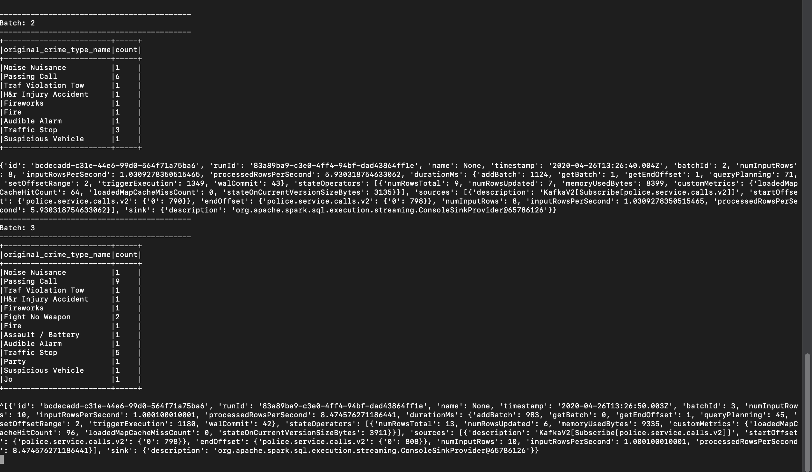

console-consumer

spark job progress

spark ui

1. **How did changing values on the SparkSession property parameters affect the throughput and latency of the data**?

    `processedRowsPerSecond` in the query progress tracker was used to benchmark the throughput of the data. A backlog of unconsumed kafka messages was created and `processedRowsPerSecond` was measured.
     The values that controlled throughput and latency were :-

        1. spark.default.parallelism : Clusters will not be fully utilized unless the level of parallelism for each operation is high enough, however a large value will
           incur task scheduling overhead. It defaults to the number of partitions in the parent RDD but we can also manually configure it.
           It is recommend to be set to 2-3 tasks per CPU core in your cluster.
        2. spark.sql.shuffle.partitions : Shuffle partitions is the number partitions in a spark dataframe created as a result of join or group operation.
           It has a default value of 200. For smaller data, 200 is an overkill and can lead to slower processing because of scheduling overheads.
           We can set it to be 1.5 or 2 times of the parent RDD partitions.

2. **What were the 2-3 most efficient SparkSession property key/value pairs? Through testing multiple variations on values, how can you tell these were the most optimal**?

        In addition to `spark.default.parallelism` and `spark.streaming.kafka.maxRatePerPartition` and methodology to choose appropriate values for them as mentioned above
        `spark.streaming.kafka.maxRatePerPartition` is useful in stabilising the stream processing. It prevents the resources of cluster machines from being overwhelmed
        when there is a large backlog of unprocessed messages. `processedRowsPerSecond` in the query progress tracker was used to benchmark the throughput of the data.
        When testing multiple variations a higher value meant more throughput and thus allowed us to choose most optimal values.

